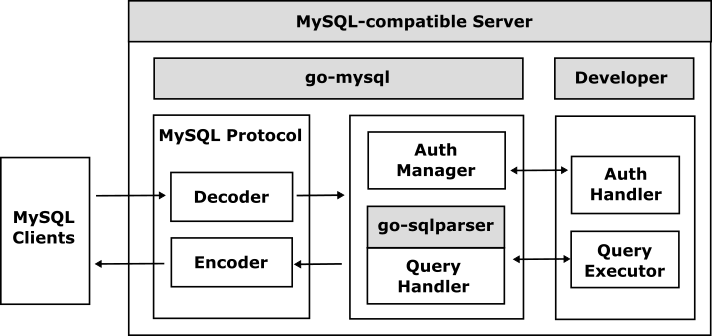

# go-mysql

 

The go-mysql is a database framework for implementing a [MySQL](https://www.mysql.com/)-compatible server using Go easily.

## What is the go-mysql?

The go-mysql handles [MySQL protocol](https://dev.mysql.com/doc/dev/mysql-server/latest/) and interprets the major messages automatically so that all developers can develop MySQL-compatible servers easily. Since the go-mysql handles all system commands automatically, developers can easily implement their MySQL-compatible server only by simply handling DDL (Data Definition Language) and DML (Data Manipulation Language) query commands.

The go-mysqld provides a implementation framework of authentication and query handlers for MySQL protocol.The go-mysqld makes it possible to implement your original [MySQL](https://www.mysql.com/)-compatible servers more easily.

In the past, go-mysql was based on [Vitess](https://vitess.io) which is a sharding framework for [MySQL](https://www.mysql.com/), but since version 1.1 the protocol layer and parser have been implemented independently and no longer depend on [Vitess](https://vitess.io/).　
The protocol handler has been re-implemented independently to support good extensions for both MySQL and MariaDB, and its SQL parser is based on [go-sqlparser](https://github.com/cybergarage/go-sqlparser), aiming to support SQL92 compliant queries.

## Table of Contents

- [Getting Started](doc/getting-started.md)

## Examples

- [Examples](doc/examples.md)
	- [go-mysqld](examples/go-mysqld)
	- [go-sqlserver](https://github.com/cybergarage/go-sqlserver)
	- [PuzzleDB](https://github.com/cybergarage/puzzledb-go)

## References

- [MySQL](https://www.mysql.com/)
	- [MySQL: Client/Server Protocol](https://dev.mysql.com/doc/dev/mysql-server/latest/PAGE_PROTOCOL.html)
- [MariaDB](https://mariadb.com/)
	- [MariaDB Knowledge Base](https://mariadb.com/kb/en/)
		- [Client/Server Protocol - MariaDB Knowledge Base](https://mariadb.com/kb/en/clientserver-protocol/)
