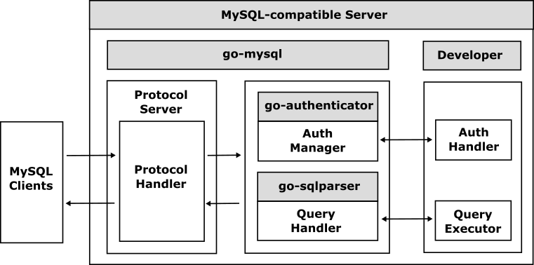

# go-mysql

The go-mysql is a database framework for implementing a [MySQL](https://www.mysql.com/)-compatible server using Go easily.

## What is the go-mysql?

The go-mysql handles [MySQL protocol](https://dev.mysql.com/doc/dev/mysql-server/latest/) and interprets any commands based on the RESP so that all developers can develop MySQL-compatible servers easily. Since the go-mysql handles all system commands automatically, developers can easily implement their MySQL-compatible server only by simply handling DDL (Data Definition Language) and DML (Data Manipulation Language) query commands.

Currentlu, the `go-mysql` is based on [Vitess](https://vitess.io) which is a sharding framework for [MySQL](https://www.mysql.com/), and the `go-mysql` makes it possible to implement your original [MySQL](https://www.mysql.com/)-compatible servers more easily reusing the binary protocol and query parser modules in [Vitess](https://vitess.io).

## Table of Contents

- [How to implement a MySQL-compatible server?](doc/getting-started.md)

## Examples

- [Examples](doc/examples.md)
  - [go-mysqld](examples/go-mysqld)

## References

- [MySQL](https://www.mysql.com/)
- [MySQL Packets – MySQL Internals Manual / MySQL Client/Server Protocol](https://dev.mysql.com/doc/dev/mysql-server/latest/)
- [Vitess](https://github.com/vitessio/vitess)