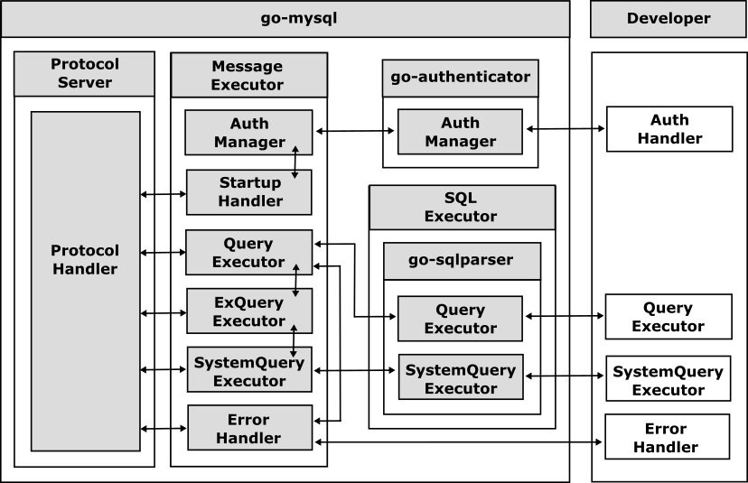

# Getting Started

This section describes how to implement your MySQL-compatible server using the go-mysql, and see  [Examples](doc/examples.md) about the sample implementation.

## Inroduction

Although go-mysql provides the following overrideable interfaces for handling MySQL protocol messages, developers generally only need to implement a go-sqlparser-based QueryExecutor and a MySQL-compatible server All that is required is to build a MySQL-compatible server.




The SystemQueryExecutor is implemented by default as required and generally does not need to be overridden and implemented. The AuthHandler need to be implemented when authentication is required, and error handlers are provided for the purpose of parsing SQL queries, e.g. to recover from the parsing process, but do not usually need to be implemented.

## STEP1: Inheriting Server


The go-mysql library provides a core server, [mysql.Server](../mysql/server.go), which is responsible for handling MySQL protocol messages. To implement your MySQL-compatible server, you should inherit the MySQL core server in your instance, as shown below.

```
import (
	"github.com/cybergarage/go-mysql/mysql"
)

type MyServer struct {
	mysql.Server
}

func NewMyServer() *MyServer {
	return &MyServer{
		Server: mysql.NewServer(),
	}
}
```

The inherited server instance is responsible for handling MySQL protocol messages. While the default message executors are implemented in the server instance, you will need to provide a SQL executor to handle SQL queries in the next step.

## STEP2: Preparing Query Handler

The inherited server instance is responsible for processing MySQL protocol messages and is configured with a default message executors, but no SQL executor. 

The SQL executor is defined in the [go-sqlparser](https://github.com/cybergarage/go-sqlparser) as the [sql.Executor](https://github.com/cybergarage/go-sqlparser/blob/master/sql/executor.go) interface. It has no dependencies on go-mysql and is also compatible with [go-postgresql](https://github.com/cybergarage/go-postgresql). The executor is defined as follows:

```go
type Executor interface {
	Begin(Conn, Begin) error
	Commit(Conn, Commit) error
	Rollback(Conn, Rollback) error	
	CreateDatabase(Conn, CreateDatabase) error
	CreateTable(Conn, CreateTable) error
	AlterDatabase(Conn, AlterDatabase) error
	AlterTable(Conn, AlterTable) error
	DropDatabase(Conn, DropDatabase) error
	DropTable(Conn, DropTable) error}
	Insert(Conn, Insert) error
	Select(Conn, Select) (ResultSet, error)
	Update(Conn, Update) (ResultSet, error)
	Delete(Conn, Delete) (ResultSet, error)	
	SystemSelect(Conn, Select) (ResultSet, error)
	Use(Conn, Use) error
}
```


To handle SQL queries on your server, prepare a query handler that conforms to the [`sql.Executor`](https://github.com/cybergarage/go-sqlparser/blob/master/sql/executor.go) interface. Then, set the SQL executor to the server instance using [mysql.Server::SetSQLExecutor](../mysql/server.go) as shown below.

```go
func NewMyServer() *MyServer {
	myServer := &MyServer{
		Server: mysql.NewServer(),
	}
    myServer.SetSQLExecutor(myserver)
    return myserver
}

func (server *MyServer) Select(conn Conn, stmt Select) (ResultSet, error) {
    .....
}
....
```

Although it is possible to replace all the default message executors with your own implementation, this chapter has provided an example where only the SQL executor has been implemented.

## STEP3: Starting Server 

After implementing the query handler, start your server using  [mysql.Server::Start()](../mysql/server.go).


```go
server := NewServer()

err := server.Start()
if err != nil {
	t.Error(err)
	return
}
defer server.Stop()

.... 
```
